<div align="center">

# deepseek-harness-vps

<p><strong>把 DeepSeek Harness 装进你的 VPS：一条命令，公网可达，界面原样</strong></p>
<p><strong>Your DeepSeek Harness on your own VPS — one command, reachable from anywhere, native UI intact</strong></p>

<p>
  <a href="LICENSE"></a>
  <a href="https://www.npmjs.com/package/dsh-vps"></a>
  
  
  
  
  
  <a href="https://dshget.com/plugins/AIcivilization/deepseek-harness-vps"></a>
</p>

<p><strong>简体中文</strong> · <a href="README.en.md">English</a></p>

</div>

---

## 简介

[DeepSeek Harness](https://github.com/deepseek-ai/deepseek-harness)（DSH）默认只认本机浏览器：它的特权接口（设置、API Key、插件管理）受浏览器信任围栏保护，直接反代到公网后这些页面全部失效。

dsh-vps 用一个零运行时依赖的登录网关（dsh-gate）架在 DSH 前面：公网请求先过 scrypt 登录门，再由网关以服务端身份完成 DSH 会话认证并透传。你在任何地方打开浏览器，用的都是官方原版的 DSH Web 界面，设置、模型、API Key、插件市场该有的都有。

DeepSeek Harness (DSH) trusts the operator's own browser only: its privileged interfaces — settings, API keys, plugin management — sit behind a browser-trust fence, and a plain reverse proxy to the public internet leaves those pages dead.

dsh-vps puts a zero-dependency login gateway (dsh-gate) in front of DSH: public requests pass a scrypt login gate first, then the gateway performs DSH session authentication server-side and proxies the rest. You open a browser anywhere and get the stock DSH web interface — settings, models, API keys and the plugin marketplace all working.

---

## 能力一览

| 能力 | 说明 |
| --- | --- |
| 一键安装 | `curl \| bash`，装完即 systemd 托管、开机自启 |
| 登录门 | scrypt 口令 + HMAC 会话 Cookie + 登录限流 |
| 浏览器初始向导 | 管理员账号、域名、DeepSeek API Key、预置插件，全程在浏览器里填完 |
| 一次性启动令牌 | 向导只对持有令牌的人开放，链接随安装输出，`dsh-vps setup-url` 可重取，设置完成即作废 |
| 预置插件一键装 | 向导内置 2 款，默认全选、可取消，后台装完自动重启生效 |
| 自动 HTTPS | Caddy 自动签发并续期证书；向导里改域名即时热加载 |
| 公网可用的原生设置页 | 设置、模型、API Key、权限策略在公网域名下照常读写 |
| 插件市场可用 | 市场里浏览/安装插件，点「立即重启」直接生效 |
| 会话自愈 | DSH 首启与插件安装需要几十秒，页面自动等待，就绪后自动进入 |
| 安全升级 | DSH 版本钉在已验证清单内，升级走备份 → 自检 → 失败自动回滚，也可随时手动回滚 |
| 可观测与可恢复 | 本机 `/gate/health` 直接给出崩溃原因与连续崩溃次数；`dsh-vps backup` 保留最近 3 份 |
| 收紧的暴露面 | 会话 Cookie 恒为 Secure/HttpOnly/SameSite；诊断接口只对服务器本机与已登录会话开放；服务以无特权的 dsh 用户运行并受 systemd 沙箱约束 |
| 仅我可访问 | 一条命令建 WireGuard 隧道，之后公网访问不到登录页，只有隧道内的设备能进；不想装东西也可用 SSH 本地转发 |

---

## 截图

<p align="center">
  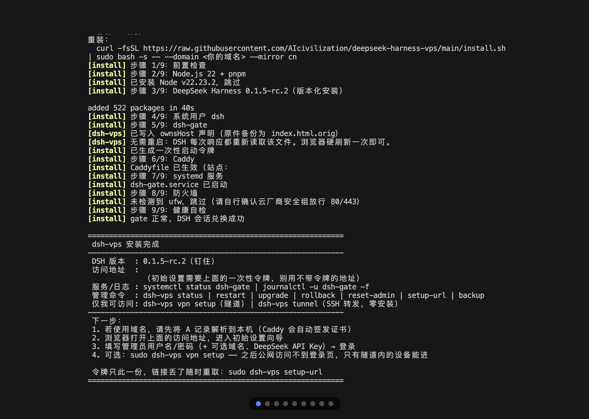
</p>

<details>
<summary><strong>展开查看 9 张原图</strong>（安装 → 向导 → 设置完成 → 登录 → DSH 界面 → 设置 → 插件市场）</summary>

<br>

| 安装完成 | 初始设置向导 | 向导已填写 |
| :---: | :---: | :---: |
| 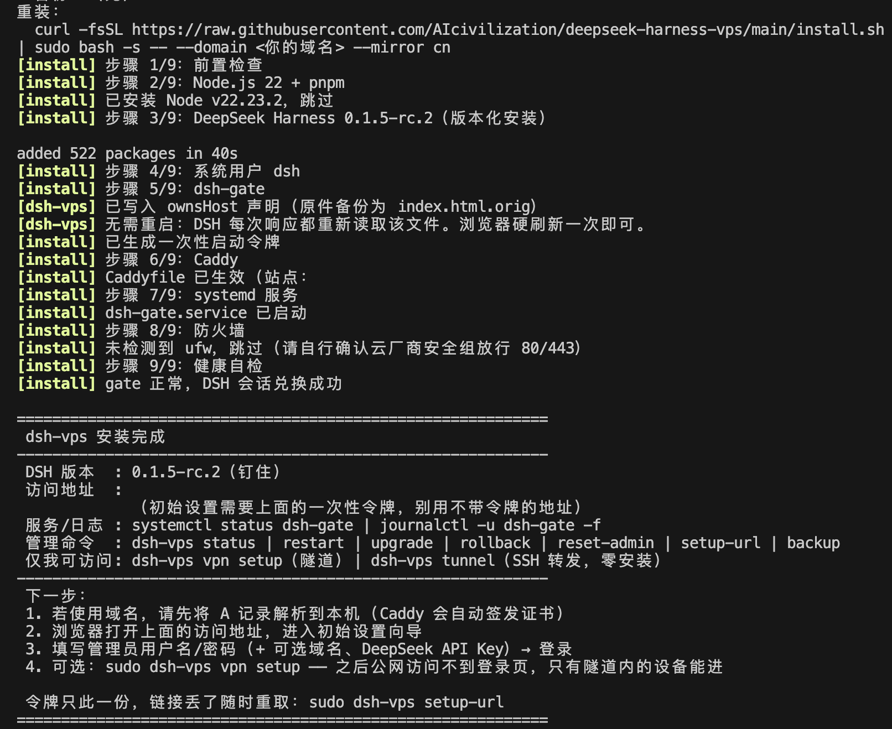 | 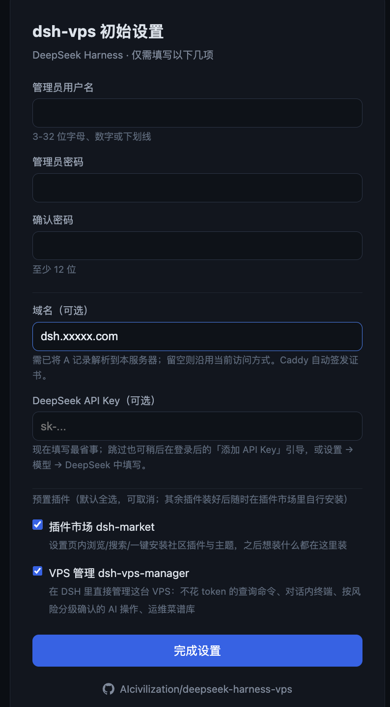 | 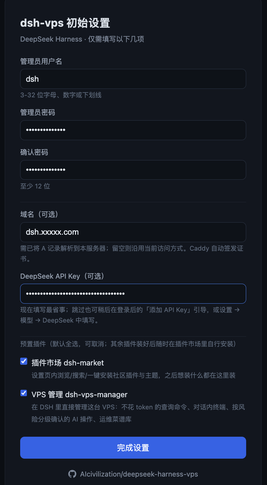 |

| 设置完成 | 登录门 | 登录 |
| :---: | :---: | :---: |
| 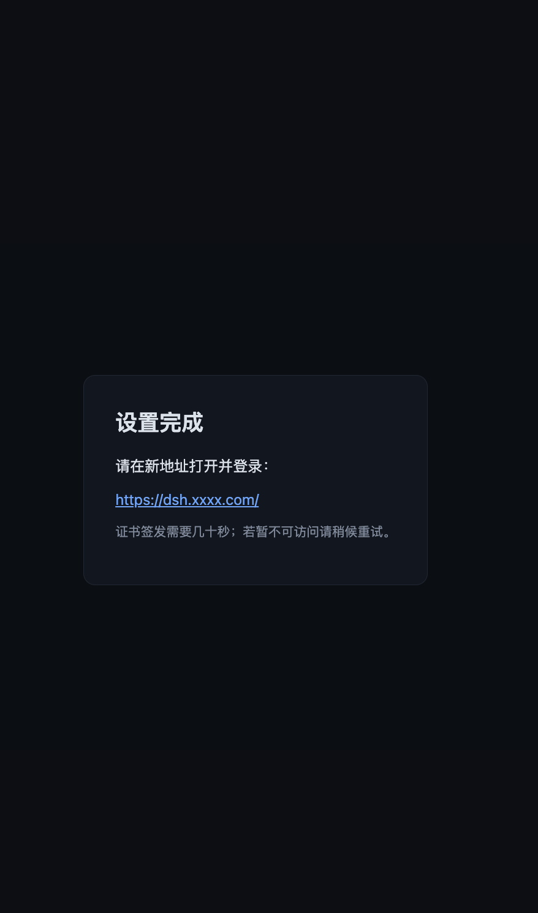 | 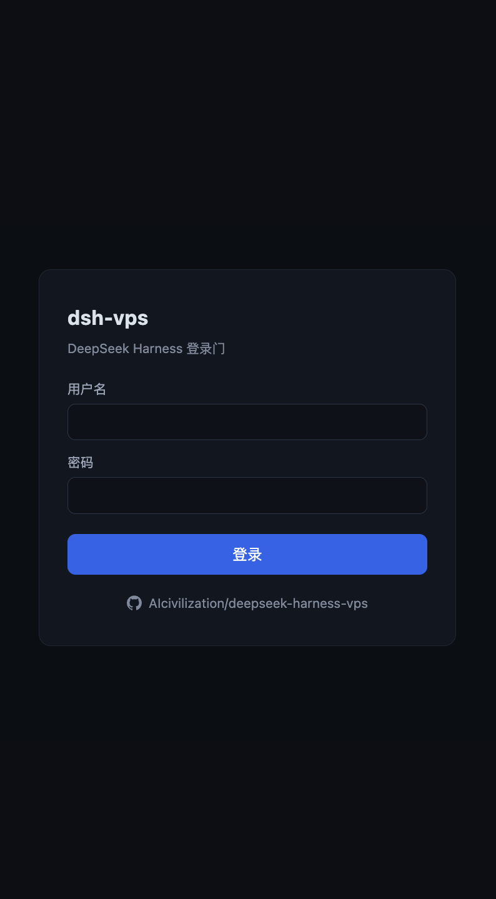 | 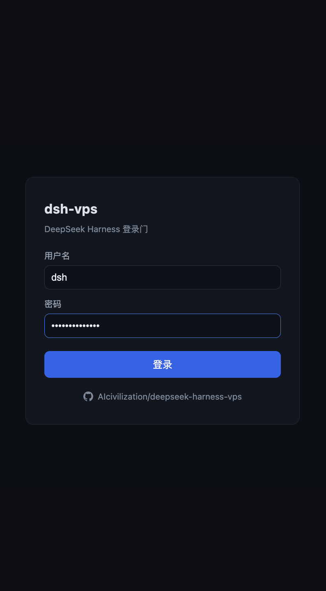 |

| DSH 原生界面 | 设置（公网域名下可用） | 插件市场 |
| :---: | :---: | :---: |
| 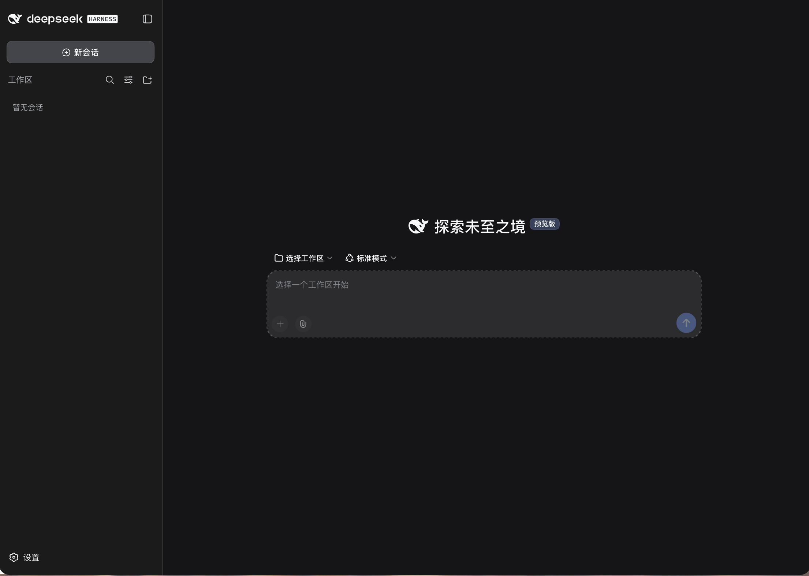 | 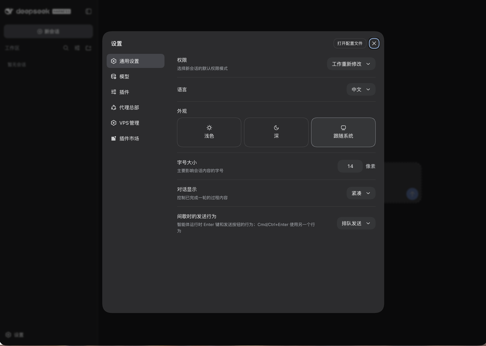 | 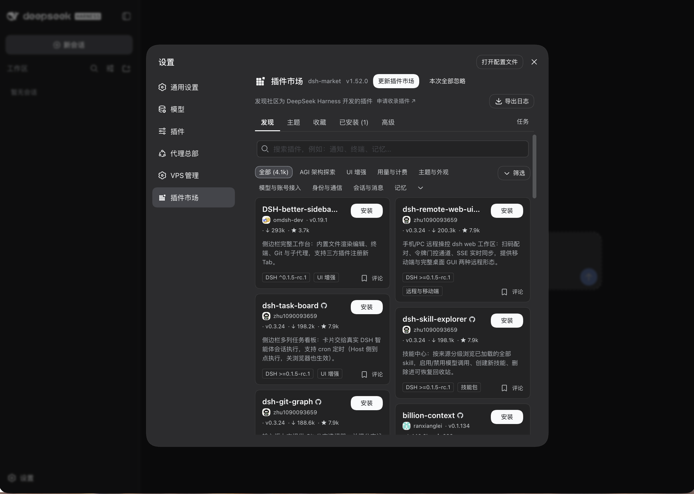 |

</details>

---

## 环境要求

- Ubuntu 22.04+ / Debian 12+（root）
- 2C2G 以上，端口 80/443 开放
- 有域名即可自动 HTTPS（先把 A 记录解析到本机）；暂无域名也能先用公网 IP + 自签证书

---

## 安装

```bash
curl -fsSL https://raw.githubusercontent.com/AIcivilization/deepseek-harness-vps/main/install.sh \
  | sudo bash -s -- --domain dsh.example.com
```

国内网络加 `--mirror cn`（Node 与 DSH 走 npmmirror）：

```bash
curl -fsSL https://raw.githubusercontent.com/AIcivilization/deepseek-harness-vps/main/install.sh \
  | sudo bash -s -- --domain dsh.example.com --mirror cn
```

还没有域名？去掉 `--domain` 即可，按公网 IP 访问：

```bash
curl -fsSL https://raw.githubusercontent.com/AIcivilization/deepseek-harness-vps/main/install.sh | sudo bash -s
```

此时证书由 Caddy 内置 CA 自签，浏览器会提示「不安全 / 证书不受信任」，属预期现象，选择继续访问即可。之后在向导里填上域名，Caddy 自动换成正式证书。

走 npm 也行，装的是这个包自带的同一份脚本（版本固定，不联网拉取；需本机已有 Node 22+）：

```bash
npx dsh-vps-install install --domain dsh.example.com
```

想固定在某个发布版本（而非 `main`），把地址里的 `main` 换成版本 tag，并让后续拉取的网关文件也用同一版本：

```bash
curl -fsSL https://raw.githubusercontent.com/AIcivilization/deepseek-harness-vps/v1.4.3/install.sh \
  | sudo DSHVPS_RAW_BASE=https://raw.githubusercontent.com/AIcivilization/deepseek-harness-vps/v1.4.3 bash -s -- --domain dsh.example.com
```

安装末尾的自检若报「DSH 尚未就绪」，设置链接照样会打印；页面会显示启动进度与具体错误，排障见 `journalctl -u dsh-gate -n 80 --no-pager`。

## 更新

已安装的机器更新网关代码：

```bash
sudo dsh-vps update-gate
```

用 v1.4.1 及更早版本装出、启动即报 `user patch-layer watching requires the Cordis HMR service` 的机器，是当时依赖冻结点有误（装进了与 DSH 0.1.5-rc.2 不兼容的 cordis 新版本）。删掉 DSH 目录后重跑安装命令即可修复，账号与数据保留：

```bash
sudo systemctl stop dsh-gate && sudo rm -rf /opt/dsh-vps/dsh/0.1.5-rc.2
```

## 卸载

```bash
curl -fsSL https://raw.githubusercontent.com/AIcivilization/deepseek-harness-vps/main/uninstall.sh \
  | sudo bash -s -- --yes
```

删除服务、安装目录、Caddy 站点块与 DSH 数据目录，删除前打包备份（含 Caddyfile）到 `/root/dsh-vps-uninstall-<时间戳>.tar.gz`。安装前原有的 Caddyfile 会被还原；WireGuard 只移除 `dsh-vps vpn` 建的 wg0，你自己的隧道配置不动。`--keep-data` 保留 DSH 数据，`--purge-caddy` 连 Caddy 一起移除。卸载完再跑安装命令即为全新环境。

---

## 首次使用

安装结束时终端会打印一条**带一次性令牌的初始设置链接**，浏览器打开它进入向导（直接打开 IP 或域名只会看到「需要启动令牌」页，这是有意的）：填管理员用户名/密码 → （可选）域名、DeepSeek API Key 与预置插件 → 登录即用。向导只对持有令牌的人开放，令牌在设置完成后自动作废。链接丢了随时重取：

```bash
sudo dsh-vps setup-url
```

API Key 跳过也无妨，登录后仍可在「添加 API Key」引导或 设置 → 模型 → DeepSeek 中补填。

勾选的插件在后台安装（约几十秒），始终取 npm 上的最新版本，装完 DSH 自动重启生效，共两款：

- **dsh-market**：设置页内浏览、搜索、一键安装社区插件与主题。其余插件留给你自己挑，装好后在市场里按需添加
- **dsh-vps-manager**：在 DSH 里直接管理这台 VPS——`/vps-` 系列查询命令不经过模型、不花 token，对话内嵌终端，AI 操作按风险分级确认，另有运维菜谱库。需在 设置 → VPS Manager 中添加本机（SSH 密钥登录）

---

## 仅我可访问（可选）

默认公网可达，靠登录页挡人。想让公网连登录页都摸不到，一条命令建隧道：

```bash
sudo dsh-vps vpn setup macbook
```

它装上 WireGuard、建好隧道并签发第一台设备的客户端配置（终端直接打印，手机用 `qrencode -t ansiutf8 < 配置` 转二维码扫）。开启后 Caddy 只放行隧道网段，其他来源直接断连，扫描器连握手都拿不到。域名与证书照旧，续期不受影响。

```bash
sudo dsh-vps vpn add iphone     # 再加一台设备
sudo dsh-vps vpn list           # 已签发设备 + 最近握手时间
sudo dsh-vps vpn revoke iphone  # 设备丢了就吊销，立即失效
sudo dsh-vps vpn status         # 访问策略 + 隧道状态 + 设备
sudo dsh-vps vpn off            # 公网立刻恢复，隧道配置留着，修好再 on
```

隧道是**分离模式**：只有访问这台 DSH 走隧道，其余流量照常走本地网络 —— 不开 IP 转发、不做 NAT，它不是全流量 VPN。SSH 始终是最外层兜底，隧道挂了也能登上去 `vpn off`。

只在电脑上用的话，连 WireGuard 都不用装，SSH 本地转发等效：

```bash
sudo dsh-vps tunnel            # 打印现成的 ssh -L 命令与 ~/.ssh/config 片段
```

浏览器把 `127.0.0.1` 视为安全来源，登录态正常生效。缺点是断开即失效、手机用不了；要常连或在手机上用就选隧道。

---

## 管理命令

```bash
sudo dsh-vps status        # 服务状态 + 健康 + 版本提示
sudo dsh-vps restart       # 重启（DSH 随之重启并自动重新兑换会话）
sudo dsh-vps upgrade       # 升级 DSH 到已验证版本（备份 → 自检 → 失败自动回滚）
sudo dsh-vps update-gate   # 拉取并重启网关自身代码（安装目录非 git 仓库，无需 git pull）
sudo dsh-vps ownshost on   # 应用设置页可用性补丁（公网域名下恢复设置页）
sudo dsh-vps selfcheck     # 跑一遍回归自检（登录 / RPC / WebSocket / 会话）
sudo dsh-vps rollback      # 切回上一 DSH 版本
sudo dsh-vps reset-admin   # 忘记管理员密码时的应急重置（重新走向导并换发令牌，已登录的会话全部失效）
sudo dsh-vps setup-url     # 重新打印带一次性令牌的初始设置链接
sudo dsh-vps backup        # 备份数据（保留最近 3 份）
sudo dsh-vps vpn setup macbook  # 建 WireGuard 隧道并切到「仅隧道可访问」
sudo dsh-vps vpn add iphone     # 再签发一台设备（打印配置 + 二维码）
sudo dsh-vps vpn list|revoke|status|on|off
sudo dsh-vps tunnel        # 零安装备选：SSH 本地端口转发用法
```

Caddy 站点块由 `gate/site-block.js` 统一生成，安装、改域名、隧道开关三处共用同一份模板。

---

## 运行机制

<p align="center">
  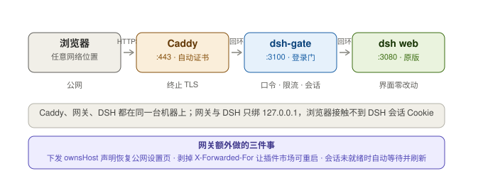
</p>

DSH 与网关均只绑 127.0.0.1，用户浏览器接触不到 DSH 的会话 Cookie，所有请求经网关认证后透传。

- **会话自愈**：首启与插件安装期间页面显示「DeepSeek Harness 正在启动」，按 3 秒一次自检，会话就绪后自动刷新进入。
- **设置页可用性**：DSH 前端按页面 hostname 判断是否为操作者本机浏览器，公网域名下会隐藏设置。网关随页面下发官方支持的 `__DSH_TRANSPORT__.ownsHost` 声明，设置页、模型、API Key 与权限策略随之恢复。`--trusted-host` 只负责打开网络围栏，两者是两道独立的门。
- **插件市场重启**：市场的「立即重启」由网关接管——它剥掉 Caddy 加的 `X-Forwarded-For`（该头会触发 DSH 的回环校验而 403），并由网关重启自己托管的 DSH 子进程，保证会话兑换链路不中断。
- **排障入口**：`sudo ss -ltnp | grep 3080` 查残留 DSH 进程；服务器上执行 `curl -s http://127.0.0.1:3100/gate/health` 可拿到 `lastError` / `lastExit` / `crashStreak`（该接口只对服务器本机与已登录会话开放）

---

## 仓库内容

| 文件 | 作用 |
| --- | --- |
| `install.sh` | 一键安装入口（唯一可选参数 `--domain`、`--mirror cn`） |
| `uninstall.sh` | 卸载并备份 |
| `bin/dsh-vps` | 运维命令行 |
| `gate/server.js` | 登录网关（Node 原生，零依赖） |
| `gate/site-block.js` | Caddy 站点块模板（安装 / 改域名 / 隧道开关共用） |
| `caddy/Caddyfile.template` | Caddy 主配置 |
| `units/dsh-gate.service` | systemd 单元模板 |
| `versions.json` | DSH 已验证版本清单 |

---

## 许可

[MIT](LICENSE)
